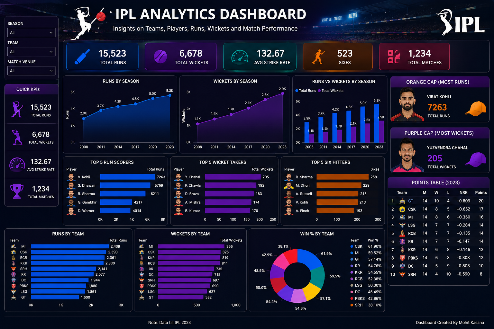

# IPL Analytics Dashboard

## Project Overview

This Power BI dashboard analyzes IPL performance across teams and players.

The dashboard helps users understand batting performance, bowling performance, strike rates, wickets, points table and match trends.

## Tools Used

- Power BI
- Excel
- DAX
- Power Query

## KPIs

- Total Runs
- Total Wickets
- Average Strike Rate
- Top Scorer
- Top Wicket Taker
- Winning Percentage

## Dashboard Features

- Team Analysis
- Player Analysis
- Bowling Analysis
- Batting Analysis
- Season Comparison
- Interactive Filters

## Key Insights

- Top Run Scorers
- Top Wicket Takers
- Best Team Performance
- Winning Trends
- Strike Rate Analysis

## Author

Mohit Kasana
